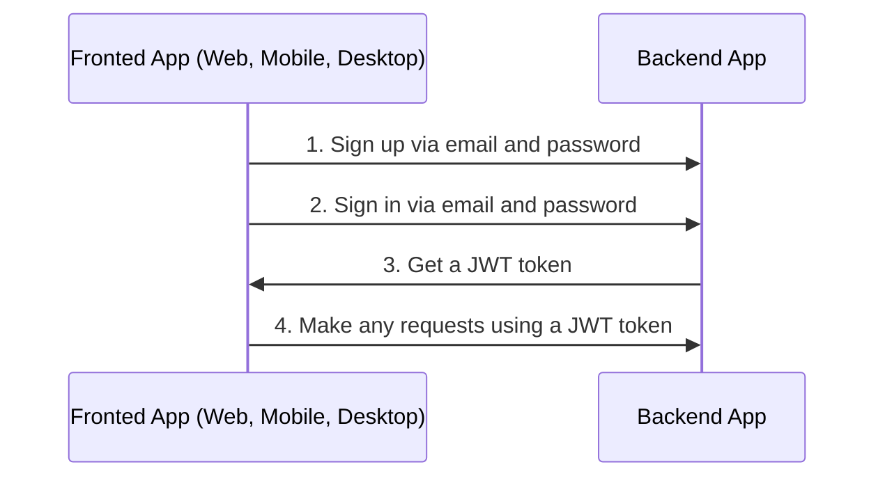
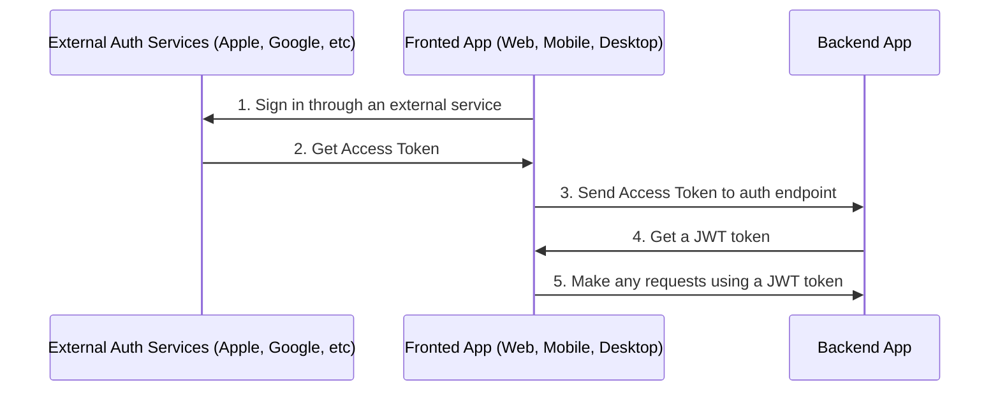

# Auth

## Table of Contents <!-- omit in toc -->

- [General info](#general-info)
  - [Auth via email flow](#auth-via-email-flow)
  - [Auth via external services or social networks flow](#auth-via-external-services-or-social-networks-flow)
- [Configure Auth](#configure-auth)
<!-- - [Auth via Apple](#auth-via-apple) -->
- [Auth via Facebook](#auth-via-facebook)
- [Auth via Google](#auth-via-google)
- [Auth via Twitter](#auth-via-twitter)
- [About JWT strategy](#about-jwt-strategy)
- [Refresh token flow](#refresh-token-flow)
- [Logout](#logout)

---

## General info

### Auth via email flow

By default boilerplate used sign in and sign up via email and password.



### Auth via external services or social networks flow

Also you can sign up via another external services or social networks like Apple, Facebook, Google, and Twitter.



For auth with external services or social networks you need:

1. Sign in through an external service and get access token(s).
1. Call one of endpoints with access token received in frontend app on 1-st step and get JWT token from the backend app.

   ```text
   POST /api/v1/auth/facebook/login

   POST /api/v1/auth/google/login

   POST /api/v1/auth/twitter/login

   POST /api/v1/auth/apple/login
   ```

1. Make any requests using a JWT token

---

## Configure Auth

1. Generate secret keys for `access token` and `refresh token`:

   ```bash
   node -e "console.log('\nAUTH_JWT_SECRET=' + require('crypto').randomBytes(256).toString('base64') + '\n\nAUTH_REFRESH_SECRET=' + require('crypto').randomBytes(256).toString('base64') + '\n\nAUTH_FORGOT_SECRET=' + require('crypto').randomBytes(256).toString('base64') + '\n\nAUTH_CONFIRM_EMAIL_SECRET=' + require('crypto').randomBytes(256).toString('base64'));"
   ```

1. Go to `/.env` and replace `AUTH_JWT_SECRET` and `AUTH_REFRESH_SECRET` with output from step 1.

   ```text
   AUTH_JWT_SECRET=HERE_SECRET_KEY_FROM_STEP_1
   AUTH_REFRESH_SECRET=HERE_SECRET_KEY_FROM_STEP_1
   ```

<!-- ## Auth via Apple

1. [Set up your service on Apple](https://www.npmjs.com/package/apple-signin-auth)
1. Change `APPLE_APP_AUDIENCE` in `.env`

   ```text
   APPLE_APP_AUDIENCE=["com.company", "com.company.web"]
   ``` -->

## Auth via Facebook

1. **Register as a Meta Developer**:
   - Go to [Meta for Developers](https://developers.facebook.com/async/registration) and register as a developer.
   - Agree to the Terms and Policies, verify your account, and provide your occupation details.
2. **Create a Facebook App**:
   - On the [App Dashboard](https://developers.facebook.com/apps), click **Create App**.
   - Select the **Authenticate and request data from users with Facebook Login** use case.
   - Provide the app name, email, and link to an existing Meta Verified Business Account if needed.
   - Complete the setup to access the app dashboard.
3. **Configure Facebook Login for your App**:
   - In your app's dashboard, locate the **Facebook Login** product and enable it.
   - Set up a redirect URI to handle OAuth callbacks in this app, typically something like:

     ```txt
     https://yourdomain.com/api/v1/auth/facebook/callback
     ```

   - Add necessary permissions in the **Permissions** section, such as `email` and `public_profile`.
4. **Update Environment Variables**:
   - In your `.env` file, add the following variables with the values obtained from the Meta App Dashboard:

     ```text
     # Facebook configuration
     FACEBOOK_APP_ID=your_facebook_app_id
     FACEBOOK_APP_SECRET=your_facebook_app_secret
     FACEBOOK_REDIRECT_URI=https://yourdomain.com/api/v1/auth/facebook/callback
     ```

5. **Detailed Setup Instructions (Optional)**:
   - For a more in-depth explanation of Facebook app creation and configuration, you can refer to the official Facebook developer documentation: [Docs](https://developers.facebook.com/docs/development/create-an-app/). This comprehensive guide will walk you through all the steps involved in setting up Facebook login for your this application.

## Auth via Google

1. You need a `CLIENT_ID`, `CLIENT_SECRET`. You can find these pieces of information by going to the [Developer Console](https://console.cloud.google.com/), clicking your project (if doesn't have create it here <https://console.cloud.google.com/projectcreate>) -> `APIs & services` -> `credentials`.
1. Change `GOOGLE_CLIENT_ID` and `GOOGLE_CLIENT_SECRET` in `.env`

   ```text
   GOOGLE_CLIENT_ID=abc
   GOOGLE_CLIENT_SECRET=abc
   ```

## Auth via Twitter

1. Set up your service on Twitter
1. Change `TWITTER_CONSUMER_KEY` and `TWITTER_CONSUMER_SECRET` in `.env`

   ```text
   TWITTER_CONSUMER_KEY=abc
   TWITTER_CONSUMER_SECRET=abc
   ```

## About JWT strategy

In the `validate` method of the `src/auth/strategies/jwt.strategy.ts` file, you can see that we do not check if the user exists in the database because it is redundant, it may lose the benefits of the JWT approach and can affect the application performance.

To better understand how JWT works, watch the video explanation <https://www.youtube.com/watch?v=Y2H3DXDeS3Q> and read this article <https://jwt.io/introduction/>

```typescript
// src/auth/strategies/jwt.strategy.ts

@Injectable()
export class JwtStrategy extends PassportStrategy(Strategy, 'jwt') {
  // ...

  public validate(payload) {
    if (!payload.id) {
      throw new UnauthorizedException();
    }

    return payload;
  }
}
```

> If you need to get full user information, get it in services.

## Refresh token flow

1. On sign in (`POST /api/v1/auth/email/login`) you will receive `token`, `tokenExpires` and `refreshToken` in response.
1. On each regular request you need to send `token` in `Authorization` header.
1. If `token` is expired (check with `tokenExpires` property on client app) you need to send `refreshToken` to `POST /api/v1/auth/refresh` in `Authorization` header to refresh `token`. You will receive new `token`, `tokenExpires` and `refreshToken` in response.

## Logout

1. Call following endpoint:

   ```text
   POST /api/v1/auth/logout
   ```

2. Remove `access token` and `refresh token` from your client app (cookies, localStorage, etc).

---

Previous: [Working with database](database.md)

Next: [Files](files.md)
